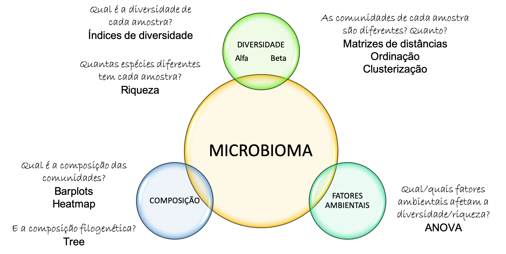

<!-- README.md is generated from README.Rmd. Please edit that file -->

```{r, include = FALSE}
knitr::opts_chunk$set(
  collapse = TRUE,
  comment = "#>",
  fig.path = "imgs/",
  out.width = "100%"
)

library(phyloseq)
library(ggplot2)
knitr::opts_chunk$set(echo = TRUE)
```

<!-- badges: start -->
[](https://GitHub.com/Naereen/)
<!-- badges: end -->

# Explorando microbiomas com R 

O R é uma linguaguem muito versátil, que é amplamente usada em diferentes áreas. Este tutorial apresenta as principais funções do pacote [Phyloseq](https://joey711.github.io/phyloseq/) para a análises de microbiomas, principalmente a partir das saída do processamento das sequencias em [qiime2](https://qiime2.org/).
Em conjunto com **ggplot2** é possível construir diversos gráficos para caracterizar e visualizar microbiomas. 

## Análise de microbiomas



Neste tutorial os principais pacotes usados são:

  


## Instalação

- `qiime2R`: Pode ser instalado a partir de `devtools`

```{r, eval = FALSE}
## Instala o pacote qiime2R que lê arquivos .qza (saída do QIIME2)
if (!requireNamespace("devtools", quietly = TRUE)){install.packages("devtools")}
devtools::install_github("jbisanz/qiime2R", force = TRUE)
```

- `phyloseq`: pode ser instalado a partir de `BiocManager`

```{r, eval = FALSE}
## Instala phyloseq
if (!requireNamespace("BiocManager", quietly = TRUE))
    install.packages("BiocManager")
BiocManager::install("phyloseq")
```

- `ggplot2`: é instalado diretamente desde o CRAN

```{r, eval = FALSE}
## Instala ggplot2
install.packages("ggplot2")
```


## Uso

Os pacotes pode ser carregados como qualquer outro pacote de R: 

```{r, message = FALSE}
library(qiime2R)
library(phyloseq)
library(ggplot2)
```

O tutorial completo se encontra [aqui](https://bit.ly/36SpwzO)
