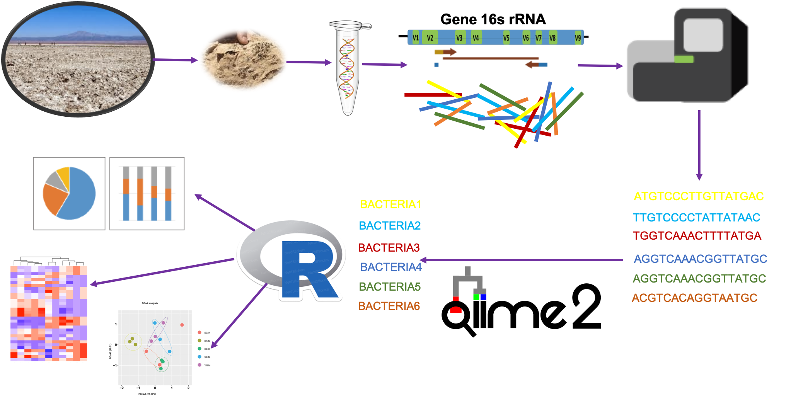
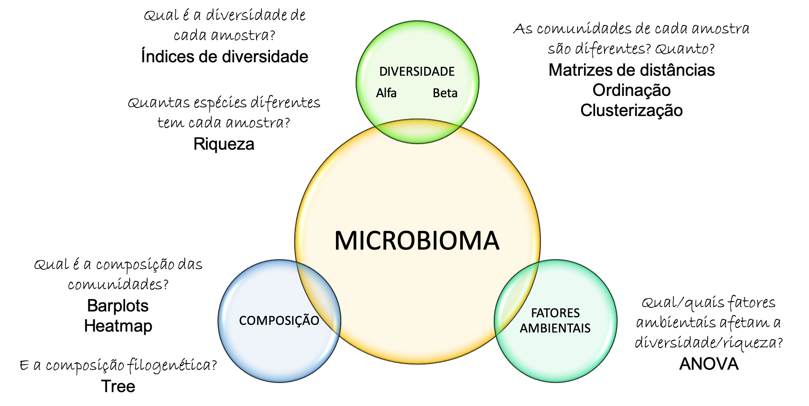
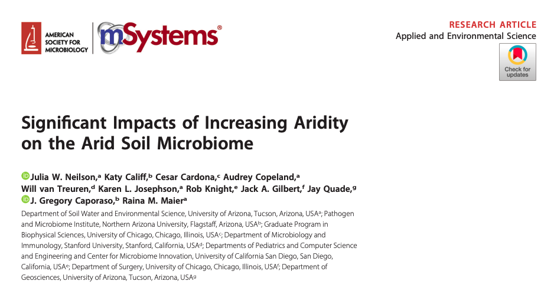
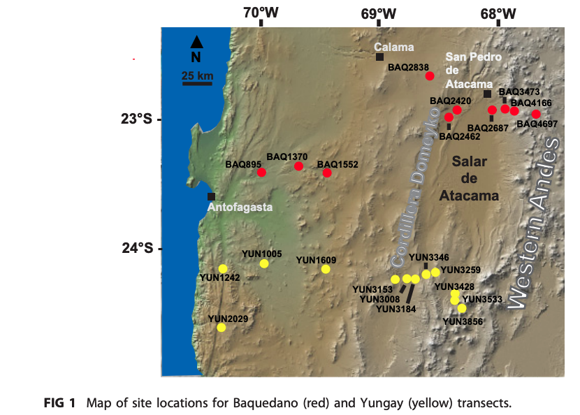
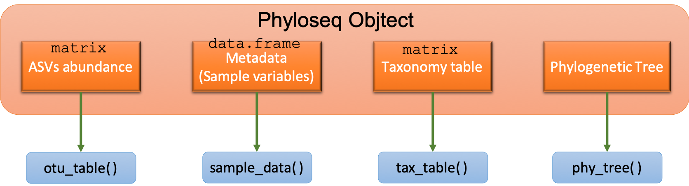
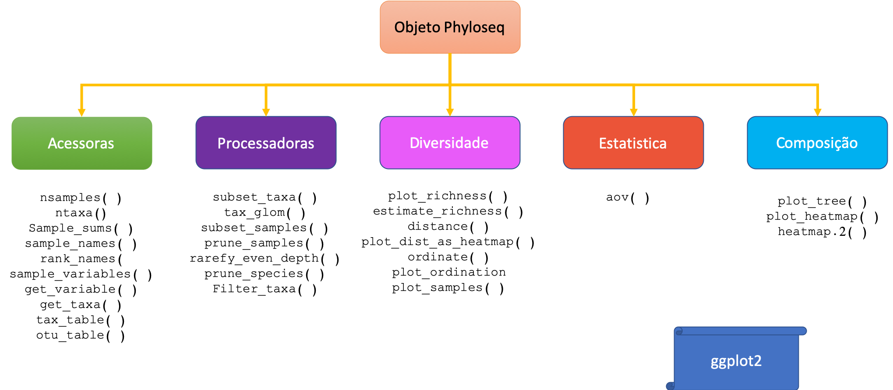

```{r xaringan-logo1, echo=FALSE}
library(xaringan)
library(xaringanExtra)
library(emo)
library(knitr)
```

```{r setup commen, include=FALSE}
knitr::opts_chunk$set(comment="")
```

```{css, echo = FALSE}
.huge .remark-code { /*Change made here*/
  font-size: 150% !important;
}
.tiny .remark-code { /*Change made here*/
  font-size: 60% !important;
}
```

```{r update1, eval = FALSE, echo=FALSE}
xaringan::inf_mr()
```

```{r share-again, echo=FALSE}
xaringanExtra::use_share_again()
```

```{r update, eval = FALSE, echo=FALSE}
xaringan::inf_mr()
```

```{r xaringanExtra-clipboard, echo=FALSE}
htmltools::tagList(
  xaringanExtra::use_clipboard(
    button_text = "<i class=\"fa fa-clipboard\"></i>",
    success_text = "<i class=\"fa fa-check\" style=\"color: #90BE6D\"></i>",
    error_text = "<i class=\"fa fa-times-circle\" style=\"color: #F94144\"></i>"
  ),
  rmarkdown::html_dependency_font_awesome()
)
```

```{r xaringan-extra-styles, echo=FALSE}
xaringanExtra::use_extra_styles(
  hover_code_line = TRUE,         #<<
  mute_unhighlighted_code = TRUE  #<<
)
```

```{r setup, include=FALSE, echo=FALSE}
require("knitr")
opts_knit$set(root.dir = "~/Google Drive File Stream/Mi unidad/GitHub/MicrobiomicaWithR/docs")
```


```{r use-logo, echo=FALSE}
xaringanExtra::use_logo("03.Images/GEMMHEX.png")
```

```{r xaringan-tile-view, echo=FALSE}
xaringanExtra::use_tile_view()
```

## Kelly Hidalgo

* `r emo::ji("colombia")` Colombiana `r emo::ji("colombia")`

* Microbióloga

* Mestre em genética e biologia molecular da Unicamp

* Doutoranda

* Grupo de Ecologia Microbiana e Multi-ômicas da Divisão de Recursos Microbianos do CPQBA- UNICAMP

* Área de pesquisa: Microbiomas de áreas contaminadas com petróleo e derivados

```{r qrcode, echo=FALSE, fig.align = 'right', out.width = "30%"}

```
---

## Introdução

R é uma linguagem muito versátil, que é amplamente usada em diferentes áreas. Aqui você vai ter uma **pequena introdução** de como usar R na análise de dados obtidos pelo sequenciamento massivo do gene 16S rRNA.
O sequenciamento massivo deste marcador filogenético permite saber quais microrganismos estão presentes em um ambiente qualquer e à abundancia relativa destes. 

```{r workflow, echo=FALSE}

```
---
class: center, middle

## Objetivo

Explorar a linguaguem R para análises de **microbiomas** 

---

# Análise de Microbiomas

```{r ggplot analises, echo=FALSE, out.width="100%", fig.align='center'}

```

---

## *Dataset* 

* Os dados fazem parte do tutorial ["Atacama soil microbiome"](https://docs.qiime2.org/2020.8/tutorials/atacama-soils/) de **Qiime2**. 

```{r paper, echo=FALSE, out.width="80%", fig.align='center'}

```

<font size="1"> 
*Significant Impacts of Increasing Aridity on the Arid Soil Microbiome.* Julia W. Neilson, Katy Califf, Cesar Cardona, Audrey Copeland, Will van Treuren, Karen L. Josephson, Rob Knight, Jack A. Gilbert, Jay Quade, J. Gregory Caporaso, and Raina M. Maier. mSystems May 2017, 2 (3) e00195-16; DOI: 10.1128/mSystems.00195-16.
</font>

* Deserto de Atacama no norte do `r emo::ji("chile")`. Esse deserto é um dos ambientes mais áridos do planeta. Tem áreas onde chove menos de um mm por década.

---

## *Dataset* 


* Os microbiomas a serem analisados neste tutorial foram coletados em dois transectos, **Baquedano** e **Yungay**, através dos quais a umidade relativa média do solo está positivamente correlacionada com a elevação (elevações mais altas são menos áridas, e, portanto, têm maior umidade relativa do solo)

* Ao longo desses transectos foram feitas covas em cada local e foram coletados solos em três profundidades em cada uma.


```{r map, echo=FALSE, out.width="50%", fig.align='center'}

```

---

## Pre-requisitos

* [Download R Software](https://cran.r-project.org/)

* [Download R Studio](https://www.rstudio.com/products/rstudio/download/)

* [Dataset](https://docs.qiime2.org/2020.8/tutorials/atacama-soils/) 

    * `Arquivos.qza` (`table.qza`, `taxonomyclassification.qza` e `tree.qza`)
    * A tabela com os metadatos
  

**IMPORTANTE:** As análises deste tutorial também podem ser feitas apartir de tabelas em formato `tsv`, `txt`, `csv`. 

---

## Pacotes

.left-column[
### Principais

```{r phhyloseq log, echo=FALSE, out.width="80%"}
knitr::include_graphics("03.Images/phyloseqsticker.png")
```

```{r ggplot log, echo=FALSE, out.width="80%"}
knitr::include_graphics("03.Images/ggplot2.png")
```
]

.right.colum[
.center[
### Outros

qiime2R

vegan

gplots

ape

reshape2

gridExtra

broom

gburr
]
]

---

class: center, middle, inverse

.huge[
# Mãos a obra
]
---

## 0. Estabeleça seu diretório de trabalho

```{r setwd, eval= FALSE}
setwd("caminho/para/seu/diretorio/de/trabalho")

```
### 0.1 Crie subdiretórios
Com o intuito de que sua análise fique organizada. Dentro de sua pasta de trabalho, crie subdiretórios para cada tipo de informação. Por exemplo `00.Scripts/` para armazenar seus códigos, `01.Data/`, para colocar todos os dados "input" da análise, e por último `02.Results/` onde você pode guardar os "outputs" da análise, como gráficos, tabelas, etc. 

```{r Dir create, eval= FALSE}
## Cria a pasta para armazenar Scripts
dir.create("00.Scripts/")#<<
## Cria a pasta para guardar os dados de entrada
dir.create("01.Data/")#<<
## Cria a pasta para armazenar as análises geradas
dir.create("02.Results/")#<<
```

---

## 1. Carregando a informação no ambiente R

### 1.1. Pacote qiime2R

Este pacote anexa os *output* do processamento das sequências usando **QIIME2** (arquivos .qza)

```{r Install qiime2R, eval= FALSE}
## Instala o pacote qiime2R que lê arquivos .qza (saída do QIIME2)
if (!requireNamespace("devtools", quietly = TRUE)){install.packages("devtools")}
devtools::install_github("jbisanz/qiime2R", force = TRUE)
```

```{r Activate library, eval= TRUE, message=FALSE}
## Ativa a biblioteca do pacote qiime2R
library("qiime2R")
```

```{r Package version, echo= TRUE, comment=""}
## Confira a versão do pacote
packageVersion("qiime2R")
```

---
class: hide_logo

### 1.2. Lendo os artefatos do qiime2 (Frequency Table)

Para ler os arquivos de saída do **qiime2** (artefatos) vamos a usar a função `read_qza()` do pacote "qiime2R"

```{r Read qza, eval= TRUE}
## Lendo o artefato table.qza, tabela com as freqüências das ASVs (espécies)
ASVs <- read_qza("01.Data/table.qza")#<<
ASVs$type # imprime o tipo de artefacto
```

Para ver a informação incluída dentro do artefato, use o comando `names()`
```{r informação dentro de table.qza, eval= TRUE, comment=""}
## Conteúdo do arquivo table.qza
names(ASVs)
```

---

Para acessar aos dados de freqüências das ASVs armazenados dentro do objeto, acesse os dados assim:
```{r ingressando nos dados, eval= TRUE}
## Mostra os primeiros 5 taxas e as primeiras 10 amostras
ASVs$data[1:5,1:10]
```
Cada linha representa um ASV (espécie) e sua frequência em cada amostra (colunas)
---

### 1.3. Lendo o Metadata

Se você quer usar o arquivo de metadata usado no qiime2, pode usar a função `read_q2metada()` como se mostra embaixo. Se usa outro tipo de arquivo tsv ou csv, pode usar `read.table()`, `readr::read_tsv()`, ou `readr::csv()`.

.tiny[
```{r lendo o metadata, eval= TRUE}
## Lê o arquivo de metadata usado no qiime2
metadata <- read_q2metadata("01.Data/sample-metadata.tsv")#<<
head(metadata) # Mostra as primeiras linhas do metadata
```
]

---
class: hide_logo

Perceba que tem diferentes variáveis, explicando seu dataset. Por exemplo, nome do transecto, elevação, humidade relativa do solo, vegetação, entre outras. Você pode colocar quantas variáveis você quiser, que vão te ajudar para que tua análise fique mais robusta e interessante. 

```{r tabela do metadata, eval= TRUE, echo=FALSE, message=FALSE}
## Library
library(kableExtra)
library(knitr)
library(gt)
library(widgetframe)
```

```{r tabela do metadata1, eval= TRUE, echo=FALSE}
kbl(metadata[1:20,c(1,9:20)]) %>%
  kable_classic("hover", full_width=F) %>%
  row_spec(0, bold = T) %>%
  kable_styling(font_size = 9) 
```

---
class: hide_logo

### 1.4. Lendo os artefatos do qiime2 (Taxonomy Table)

Agora é momento de importar o artefato que contém a anotação taxonômica de cada um dos ASVs encontradas em nosso dataset.
.tiny[
```{r lendo o taxonomy table, eval= TRUE}
## Lê o artefato da anotação taxonômica
taxonomy <- read_qza("01.Data/taxonomyclassification.qza")#<<
head(taxonomy$data)[1:10,] # Mostra os dados armazenados no objeto taxonomy
```
]
---
class: hide_logo

```{r tabela do metadata2, eval= TRUE, echo=FALSE}
kbl(taxonomy$data[1:25,]) %>%
  kable_classic("hover", full_width=T) %>%
  row_spec(0, bold = T)%>%
  kable_styling(font_size = 9) 

```

---

```{r colunas taxonomia, eval= TRUE}
## Quebra a coluna "taxon" em varias colunas organizadas com os níveis taxonômicos
taxonomy <- parse_taxonomy(taxonomy$data)#<<
tail(taxonomy) # Mostra as últimas 6 linhas
```

---
class: middle

### 1.5. Lendo os artefatos do qiime2 (Tree)
Agora vamos a ler e armazenar no ambiente do R, a árvore filogenética.
```{r lendo a arvore, eval= TRUE}
tree <- read_qza("01.Data/tree.qza")
```

---
class: center, middle

###Estrutura Objeto Phyloseq


```{r objetophyloseq, echo=FALSE, out.width="100%", fig.align='center'}

```

.tiny[
Instalação:
```{r instalando phyloseq, eval= FALSE}
## Instala phyloseq
if (!requireNamespace("BiocManager", quietly = TRUE))
    install.packages("BiocManager")
BiocManager::install("phyloseq")
```
]
---

## 2. Criando o objeto phyloseq
A função `qza_to_phyloseq()` vincula varios artefatos lidos com `read_qza()` para criar um **objeto phyloseq** para as análises subsequentes. 


```{r criando objeto phyloseq, eval= TRUE}
physeq<-qza_to_phyloseq(
    features = "01.Data/table.qza",
    tree="01.Data/tree.qza",
    taxonomy="01.Data/taxonomyclassification.qza",
    metadata = "01.Data/sample-metadata.tsv"
    )
physeq #Mostra o objeto phyloseq criado
```

Você tem um dataset com 54 amostras com 22 variáveis, e 1082 taxas diferentes em 7 níveis taxonômicos. 

---
class: center, middle

### Funções

```{r funcoes, echo=FALSE, out.width="100%", fig.align='center'}

```

---

## 2.1 Acessores do phyloseq

Dentro do phyloseq existem uma série de funções acessoras, que servem para você "acessar" na informação armazenada no objeto phyloseq criado. 

### nsamples()

```{r explorando o objeto phyloseq, eval= TRUE}
## Ativar a biblioteca do pacote phyloseq
library(phyloseq)
# imprime o número de amostras do seu objeto
nsamples(physeq)#<<
```

---

### ntaxa()

```{r explorando o objeto phyloseq2, eval= TRUE}
# imprime o número de taxas do seu objeto
ntaxa(physeq) #<<
```

### sample_names()

```{r explorando o objeto phyloseq2.2, eval= TRUE}
 # imprime os nomes das amostras do seu objeto
sample_names(physeq)#<<
```

---

### rank_names()
```{r explorando o objeto phyloseq2.1, eval= TRUE}
 # imprime os níveis taxonômicos do seu objeto
rank_names(physeq)#<<
```

### sample_variables()

```{r explorando o objeto phyloseq3, eval= TRUE}
 # imprime as variáveis de sua data
sample_variables(physeq)#<<
```

---

### sample_sums()
```{r explorando o objeto phyloseq4, eval= TRUE}
# imprime a soma das freqüências de todas as ASVs por amostra
sample_sums(physeq)#<<
```

---

### get_variable()
```{r explorando o objeto phyloseq5, eval= TRUE}
# imprime os níveis da variável desejada
get_variable(physeq, varName = "elevation")#<<
```

### get_taxa()
```{r explorando o objeto phyloseq5.1, eval= TRUE}
 # Imprime as freqüências das ASVs na amostra desejada
head(get_taxa(physeq, i = "BAQ3473.1"))#<<
```

---

## 2.2. Processadores do phyloseq (Filtering options)

Além da funções acessoras, o **phyloseq** tem funções processadoras. 

### subset_taxa()

Por exemplo, você poderia estar interesad@ em ficar só com um grupo específico de microrganismos, para isto o phyloseq tem a função `subset_taxa()`.

```{r filtrando Firmicutes, eval= TRUE}
Firmicutes_physeq <- subset_taxa(physeq, Phylum == "Firmicutes")#<<
## Confira
ntaxa(Firmicutes_physeq)
```

---

```{r filtrando Firmicutes2, eval= TRUE}
head(tax_table(Firmicutes_physeq))[ , c("Class", "Order")] # Mostra a informação das colunas Phylum, Class e Order.
```
Agora você tem o objeto `Firmicutes_physeq`, o qual tem 45 taxas diferentes dentro, todas do phylum Firmicutes.

---
class: hide_logo

### subset_taxa()

E se você está interessado só na ordem "Bacilli" que pertence ao phylum "Firmicutes"? 

```{r filtrando Clostridia, eval= TRUE}
bacilli_physeq <- subset_taxa(physeq, Phylum == "Firmicutes" & Class == "Bacilli")#<<
## Confira
ntaxa(bacilli_physeq)
head(tax_table(bacilli_physeq)) [ , c("Phylum", "Class", "Order")]
```

---
class: hide_logo

### tax_glom()

Outra função processadora, é `tax_glom()`, a qual serve para "colapsar" as ASVs num nível taxônomico específico. As vezes você quer fazer análises só no nível de Clase. A função `tax_glom()` aglomera as ASVs em um nível taxonômico desejado.

```{r tax_glom, eval= TRUE}
class_physeq <- tax_glom(physeq, "Class")#<<
## Confira
ntaxa(class_physeq)
head(tax_table(class_physeq))[ , c("Phylum", "Class")]
```
Perceba que tem 57 Clases diferentes.

---
class: middle

### tax_glom()

Para entender melhor o que faz `tax_glom()`, imagine que sua informação é assim:

```{r exemplo, eval= TRUE, echo=FALSE}
ASV <- c("743b243a1305866076ee9822f873a166", "743b243a1305866076ee9822f873a166", "894f55d058e6e2ba106015899dd588e6", "894f55d058e6e2ba106015899dd588e6", "743b243a1305866076ee9822f873a166")
k <- c("d__Bacteria","d__Bacteria","d__Bacteria","d__Bacteria","d__Bacteria")
p <- c("Firmicutes", "Firmicutes", "Firmicutes", "Firmicutes","Firmicutes")
c <- c("Clostridia", "Clostridia", "Bacilli", "Bacilli", "Clostridia")
o <- c("Clostridiales", "Clostridiales", "Bacillales", "Bacillales", "Clostridiales")
f <- c("Peptococaceae", "Peptococaceae", "Bacillaceae", "Bacillaceae", "Peptococaceae")
g <- c("Pelotomaculum", "Pelotomaculum", "Bacillus", "Bacillus", "Pelotomaculum")
a <- c("2", "3", "5", "1", "7")
taxtable <- cbind(ASV,k,p,c,o,f,g,a)
colnames(taxtable) <- c("ASVs", "Kingdom", "Phylum", "Class", "Order", "Family", "Genus", "Abundance")
```

```{r exemplo2, eval= TRUE, echo=FALSE}
kbl(taxtable) %>%
  kable_classic("hover", full_width=F) %>%
  row_spec(0, bold = T)%>%
  kable_styling(font_size = 9)
```

Após aplicar a função `tax_glom()` ao nível de classe, ficaria assim:

```{r exemplo3, eval= TRUE, echo=FALSE}
ASV <- c("743b243a1305866076ee9822f873a166", "894f55d058e6e2ba106015899dd588e6")
k <- c("d__Bacteria","d__Bacteria")
p <- c("Firmicutes", "Firmicutes")
c <- c("Clostridia", "Bacilli")
a <- c("12", "6")
taxtable1 <- cbind(ASV,k,p,c,a)
colnames(taxtable1) <- c("ASVs", "Kingdom", "Phylum", "Class", "Abundance")
```

```{r exemplo4, eval= TRUE, echo=FALSE}
kbl(taxtable1) %>%
  kable_classic("hover", full_width=F) %>%
  row_spec(0, bold = T)%>%
  kable_styling(font_size = 9)
```

---

### subset_samples()

Com a função `subset_samples()` você pode separar amostras baseado nos metadatos. Por exemplo, imagine que você só quer fazer uma análise separada das amostras do transecto "Baquedano", nos seguientes comandos vai criar um novo objeto só com essas amostras.

```{r filtrando amostras, eval= TRUE}
baquedano_physeq <- subset_samples(physeq, transect.name %in% c("Baquedano"))#<<
## Confira
head(sample_data(baquedano_physeq))[,1:5] # Mostra as primerias informações da nova tabela de metadatos
baquedano_physeq # informações do novo objeto
```
Você agora tem no novo objeto "baquedano_physeq" as amostras que correspondem ao transecto *Baquedano*.

---
class: hide_logo

### prune_samples()

Outro jeito de filtrar amostras é com a função `prune_samples()`. Com está função você pode selecionar amostras baseado na posição delas nos metadatos, como se mostra a continuação:
```{r filtrando amostras com prune_samples, eval= TRUE}
samplesToKeep <- sample_names(physeq) [1:15] # Cria um vetor, pegando as primeiras 15 amostras do objeto physeq (original) usando o acessor samples_names.
samplesToKeep ## Confira o vetor
first15samples_physeq <- prune_samples(samplesToKeep, physeq)#<<
## Confira o novo objeto
first15samples_physeq
```

Você criou um novo objeto com as primeiras 15 amostras do dataset.

---

## 2.3. Manipulação de abundancias

### rarefy_even_depth()

A função `rarefy_even_depth()` normaliza todas as amostras à uma mesma profundidade (soma das freqüências de todas ASVs em cada amostra) e elimina as ASVs que desaparecem de todas as amostras como resultado da normalização.
```{r rarefy_even_depth, eval= TRUE}
rare_physeq <- rarefy_even_depth(physeq, rngseed = min(sample_sums(physeq)), replace = TRUE, trimOTUs = TRUE)#<<
```

---

Confira a soma das amostras no novo objeto que devem ser todas iguais

```{r rarefy_even_depth2, eval= TRUE}
sample_sums(rare_physeq) 
```

Neste caso essa rarefação vai nos levar a perda de muita informação, pois tem uma amostras só com 28 sequências. Você poderia eliminar amostras com baixa profundidade de sequenciamento para evitar a perdida de maior quantidade de informação. 

---

Agora que identificou que tem varias amostras com pouca profundidade, pode estabelecer um *threshold* para eliminar ditas amostras. 

Primeiro organize em ordem crescente as amostras pela soma total de ASVs 

```{r ordenando amostras, eval= TRUE}
sort(sample_sums(physeq)) # Imprime e ordena de forma crescente as amostras segundo o tamanho
```

---

### prune_samples()

Agora elimine as amostras com menor tamanho com a função `prune_samples()`

```{r eliminando amostras, eval= TRUE}
# Cria um novo objeto só com as amostras com tamanho maior de 200
physeq2 <- prune_samples(sample_sums(physeq)>= 200, physeq) #<<
sort(sample_sums(physeq2)) # confira
```

---

```{r eliminando amostras2, eval= TRUE}
physeq2 # novo objeto
``` 

No novo objeto agora você tem 52 amostras que cumprem com o filtro usado.

### transform_sample_counts()

Outro jeito de normalizar é transformando os valores das freqüências das ASVs em valores de abundancias relativas ao tamanho total de cada amostra.

```{r transform_sample_counts, eval= TRUE}
count_to_prop <- function(x) {return (x / sum (x))} # Cria uma função que divide cada valor x (Freuências de ASVs) entre a soma total de cada amostra.
# aplica a função no objeto original e cria um novo objeto com os valores transformados
transf_physeq <- transform_sample_counts(physeq, count_to_prop) #<<
```

---

```{r transform_sample_counts2, eval= TRUE}
sample_sums(transf_physeq) # Confira a soma das amostras do novo objeto, deve ser 1
```

---

## 3. Análise exploratória
Agora vamos a fazer uma análise exploratória de nossos dados. 

### 3.1 Diversidade Alfa 
A diversidade alfa é igual a riqueza, ou seja número de espécies diferentes. Se refere à diversidade dentro de cada amostra, e pode ser "quantificada" usando diferentes métricas como, "Espécies Observadas", o estimador "Chao1" e indices de diversidad como "Shannon" e "Simpson".

.tiny[
* Observed: é a métrica mais básica, é simplesmente o número de espécies diferentes observadas.

* Chao1: é um estimador, dando importancia para as espécies ¨raras¨. 
$$
Observed + estimativa das espécies não observadas 
$$ 
* Shannon: Além da riqueza contempla a uniformidade da distribuição das abundancia das espécies

* Simpson: é igual a 1 - a probabilidade que duas bactérias escolhidas ao acaso na comunidade pertençam a espécies diferentes. Também é o conhecido como indice de dominância.
]
---
class: hide_logo

### plot_richness()

Com a função `plot_richness()` do *Phyloseq* é possivel graficar as métricas desejadas.

```{r boxplot diversidade alfa, eval= TRUE, warning= FALSE, out.width="60%", fig.align="center"}
obj <- physeq; p <- plot_richness(obj, color = "SampleName", x = "SampleName", measures = c("Observed", "Chao1", "Shannon", "Simpson")); p
```

---
class: hide_logo, middle

Agora vamos informar para o R que o gráfico é de tipo "boxplot" e adicionalmente vamos a customizar o gráfico usando funções do pacote ggplot2.

.pull-left[
```{r ativa ggplot2, eval= FALSE}
library(ggplot2) # Ativa a biblioteca do pacote ggplot2
p <- p + geom_boxplot(aes(fill = "SampleName"), alpha=0.2, size=0.5) + theme_bw() # informa que quer que seja gráfico na forma de boxplot
p <- p + theme(strip.background =element_rect(fill="black")) # personaliza a cor da faixa onde está o nome da cada métrica
p <- p + theme(strip.text = element_text(colour = 'white', size = 10, face = "bold")) # personaliza a letra na mesma faixa anterior, sendo de cor branca, tamnaho 10 e negrita
p <- p + theme(plot.margin = unit(c(0,1,0,1), "cm")) # Coloca margens
p <- p + theme(axis.text.x = element_blank()) # personaliza o texto no eixo x
p <- p + theme(axis.text.y = element_text(angle = 0, hjust = 1, size=8,color="black")) # personaliza o texto no eixo y
p <- p + labs(x = "SampleName", y = "Alpha Diversity Measure") # Coloca nome nos eixos
p 
```
]

.pull-right[
```{r plot-label-out, ref.label="ativa ggplot2", echo=FALSE}
```
]

Com ggplot2 você pode personalizar todos os elementos que compoem o gráfico. 

---
class: middle

### *Ready-to-print*

`ggsave()`

```{r salva o gráfico boxplot, eval= FALSE}
ggsave("02.Results/alpha_diversity_boxplot.tiff", units = "in", width=14, height=8, dpi=600, compression = 'lzw', p) # Salva o gráfico na pasta de resultados em formato .tiff com as medidas desejadas e a resolução de 600 dpi.
ggsave("02.Results/alpha_diversity_boxplot.pdf", units="in", width=11, height=8, dpi=600, p) # Salva o gráfico em formato pdf
```

---
class: hide_logo, middle

Outro jeito de graficar sem ser boxplot é:

.pull-left[
```{r shannon-phyloseq, eval= FALSE, warning=FALSE, message=FALSE}
diversity_indexes <- c("Observed", "Chao1", "Shannon", "Simpson") # Cria um vector com as métricas de diversidade alfa que vão ser usadas.
p <- plot_richness(physeq, color = "elevation", x = "SampleName", shape = "vegetation", measures = diversity_indexes) + # plota os valores das métricas de diversidade, usando uma escala de cor para a elevação, e formas para diferenciar entre com ou sem vegetação
ggtitle("Alpha diversity index") + # coloca título
scale_alpha_discrete(name="elevation") + # escala de cor pra variável discreta
geom_point(size=2) # personaliza o tamnho do ponto
p
```
]

.pull-right[
```{r plot-label-out2, ref.label="shannon-phyloseq", echo=FALSE, message=FALSE, warning=FALSE}
```
]

---
class: middle

E se você simplesmente quer guardar todos os dados das métricas de diversidade alfa em uma tabela?

```{r tabela diversidade alfa, eval= TRUE, message=FALSE, warning=FALSE}
alpha_diversity_data <- estimate_richness(physeq, measures = diversity_indexes)
```
```{r tabela diversidade alfa2, eval= FALSE, message=FALSE, warning=FALSE}
write.csv(alpha_diversity_data, "02.Results/alpha_diversity.csv")
```

```{r exemplo5, eval= TRUE, echo=FALSE}
kbl((alpha_diversity_data)[1:15, ]) %>%
  kable_classic("hover", full_width=F) %>%
  row_spec(0, bold = T)%>%
  kable_styling(font_size = 9)
```

---
class: hide_logo

### ANOVA

Você pode fazer ANOVA para testar se uma determinada métrica é significativamente diferente em função de algumas variáveis de seu estudo. Por exemplo, o transeto tem um efeito significativo no número de espécies observadas.

```{r ANOVA, eval= TRUE}
data <- cbind(sample_data(physeq), alpha_diversity_data) # Junta o componente sample_data do objeto physeq com a tabela das métricas de diversidade criada anteriormente
data[1:15, c(2,4,23,24,26,27)] # Observe
```

---
class: hide_logo

### ANOVA

```{r ANOVA5, eval= TRUE}
physeq.anova <- aov(Observed ~ transect.name, data) # Aplica o modelo de ANOVA para comparação entre a métrica de espécies observadas (Observed) e a variável "transect.name"
summary(physeq.anova) # Imprime o resumo da ANOVA
```

Ao observar o *valor de p* da estatística F usada no modelo de análises de variancias, pode se concluir que o transeto não tem efeito no número de espécies observadas, ou seja não existe diferencias estatísticamente significativas entre o número de espécies observadas nas amostras dos dois transetos. 
Mas será que a elevação tem efeito no indice de diversidade de Shannon?

```{r ANOVA2, eval= TRUE}
physeq.anova2 <- aov(Shannon ~ elevation, data) # Aplica o modelo de ANOVA para comparação entre a métrica de espécies observadas (Observed) e a variável "transect.name"
summary(physeq.anova2) # Imprime o resumo da ANOVA

```

Sendo um valor de p baixo (nível de confiança 95%), pode se concluir que a **elevação tem um efeito significativo no indice de diversidade Shannon**.

---

### 3.1 Diversidade Beta

A diversidade Beta responde à pergunta quão similares ou diferentes são duas comunidades (amostras)? Para "medir" essas diferenças se usam matrizes de distancias. As métricas de distancias mais usadas para microbiomas são:
* Jaccard: qualitativa (ausencia/presencia)

* Bray-Curtis: quantitativa, além da presente/não presente leva em conta as abundancias

* Unweighted Unifrac: Distancias filogenéticas. Qualitativa.

* Weighted Unifrac: Distancias filogenéticas. Quantitativa.

Um jeito de visualizar as matrizes de similaridades é usando heatmap. O Phyloseq tem a função **extra** `plot_dist_as_heatmap()` que permite graficar as distancias.

---
class: middle

### Instalandos as funções extra do Phyloseq

```{r extra functions, eval= TRUE, message=FALSE}
# Para carregar as funções extras é necessário ativar os seguintes pacotes. Senão tiver eles instaldos use o comando install.packages() e depois ative as bibliotecas
library(reshape2) 
library(ggplot2)
library(phyloseq)
library(ape)
library(gridExtra)
# Cria um vetor com o`nome dos scripts das funções extras
scripts <- c("graphical_methods.R", 
             "tree_methods.R", 
             "plot_merged_trees.R", 
             "specificity_methods.R", 
             "ternary_plot.R", 
             "richness.R", 
             "edgePCA.R", 
             "copy_number_correction.R", 
             "import_frogs.R", 
             "prevalence.R", 
             "compute_niche.R")

urls <- paste0("https://raw.githubusercontent.com/mahendra-mariadassou/phyloseq-extended/master/R/", scripts) # Concatena o vetor contido no repositório no github com o criado com os nomes dos scripts.

for (url in urls) {
  source(url) 
} # "instala" cada nova função
```

---

### plot_distances()

Para gerar as matrizes de distancias use a função `distance()`

```{r distance, eval= TRUE, warning= FALSE}
distanceMethodList ## Lista os métodos disponíveis
```

---

### plot_distance()
```{r distance_, eval= TRUE, warning= FALSE}
metodos_distancias <- unlist(distanceMethodList) # cria um vetor com os métodos disponíveis
```

Gere as matrizes de distancias

```{r distance2, eval= TRUE, warning= FALSE}
dist.bc <- distance(physeq, method = "bray") # Gera a matriz de distância usando a métrica Bray-Curtis
dist.jaccard <- distance(physeq, method = "jaccard") # Matriz usando Jaccard
dist.unifrac <- distance(physeq, method = "unifrac") # Matriz usando Unweighted Unifrac
dist.wunifrac <- distance(physeq, method = "wunifrac") # Matriz usando Weighted Unifrac
```

Após criadas as matrizes de distancias, agora pode gerar os heatmaps

```{r plot distance, eval= TRUE, warning= FALSE, message=FALSE}
p1 <- plot_dist_as_heatmap(dist.bc, title = "Bray-Curtis") + 
  theme(axis.text.x = element_blank()) + 
  theme(axis.text.y = element_blank())# Heatmap matriz de distancia Bray-Curtis
p2 <- plot_dist_as_heatmap(dist.jaccard, title = "Jaccard") + 
  theme(axis.text.x = element_blank()) + 
  theme(axis.text.y = element_blank()) # Heatmap matriz de distancia Jaccard
p3 <- plot_dist_as_heatmap(dist.unifrac, title = "Unifrac") + 
  theme(axis.text.x = element_blank()) + 
  theme(axis.text.y = element_blank()) # Heatmap matriz de distancia Unifrac
p4 <- plot_dist_as_heatmap(dist.wunifrac, title = "Weighted Unifrac") + 
  theme(axis.text.x = element_blank()) + 
  theme(axis.text.y = element_blank()) # Heatmap matriz de distancia Weighted Unifrac
```

---
class: middle

```{r plot distance2, eval= FALSE, warning= FALSE, message=FALSE, out.height="60%", fig.align="center"}
pf <- grid.arrange(p1,p2,p3,p4, ncol = 2, nrow = 2); pf
ggsave("02.Results/matrizesdistancia.tiff", units = "in", width=14, height=8, dpi=600, compression = 'lzw', pf) # Salva o gráfico na pasta de resultados em formato .tiff com as medidas desejadas e a resolução de 600 dpi.
```

---
class: middle

### Algumas interpretações:

  * Jaccard maior que Unifrac: os taxa são distintos mas filogenéticamente relacionados.
  * Unifrac maior que Weighted Unifrac: Taxa abundantes em ambas comunidades são filogenéticamente próximos

Um outro jeito mais usado para visualizar essas diferencias calculadas nas matrizes é usando gráficos de ordinação como PCA, PCoA, NMDS...

### ordinate()

A ordinação é feita através da função `ordinate()`.


```{r ordination, eval= TRUE, warning=FALSE}
ord.bc <- ordinate(physeq, method = "MDS", distance = "bray") # Pode usar diretamente o nome da métrica
ord.bc <- ordinate(physeq, method = "MDS", distance = dist.bc) # ou usar as matrizes geradas anteriormente
ord.jaccard <- ordinate(physeq, method = "MDS", distance = "jaccard")
ord.unifrac <- ordinate(physeq, method = "MDS", distance = "unifrac")
ord.wunifrac <- ordinate(physeq, method = "MDS", distance = "wunifrac")
```

---
class: hide_logo

### plot_ordination()

Uma vez feitas as ordinações, agora com a função `plot_ordination()` grafique

.pull-left[
```{r plot ordination, eval= FALSE, warning = FALSE, out.width="60%", fig.align="center"}
p1 <- plot_ordination(physeq, ord.bc, color = "site.name") + 
  theme_bw()
p1
```
]

.pull-right[
```{r plot-label-out3, ref.label="plot ordination", echo=FALSE}
```
]
---
class: hide_logo

### plot_samples()

A função `plot_samples()` é similar à `plot_ordination()` mas pode replicar um parametro a mais, veja só:

.pull-left[
```{r plot samples, eval= FALSE, out.width="55%", fig.align="center"}
p1 <- plot_samples(physeq, ord.bc, 
                   color = "site.name", 
                   replicate = "site.name", 
                   shape = "vegetation") +
  theme_bw()
p1
```
]
.pull-right[
```{r plot-label-out4, ref.label="plot samples", echo=FALSE}
```
]

---
class: hide_logo

### plot_samples()

Perceba que as cores não facilitam a diferenciação entre uma amostra e outra. Neste ["Site"](http://medialab.github.io/iwanthue/) você pode criar paletas de cores, é só colocar o número de cores que você precisa, copiar e colar os códigos "HEX json" e guardar eles no R em forma de vetor, assim:

.pull-left[
```{r plot samples2, eval= FALSE, message=FALSE, out.width="50%", fig.align="center"}
# Crie uma paleta de 17 cores
colors17 <- c("#8b53a0", "#5bab4b", 
              "#c954bf", "#99a142", 
              "#7463d6", "#d89733", 
              "#5372ba", "#d14e36", 
              "#4facd8", "#de4379", 
              "#4aaa86", "#a24576", 
              "#8e6229", "#a495e1", 
              "#dc946c", "#da87bf", 
              "#c05e66") 
p1 <- p1 + scale_color_manual(values = c(colors17))
p1
```
]

.pull-right[
```{r plot-label-out5, ref.label="plot samples2", echo=FALSE}
```
]
---

### Personalizando o gráfico

.pull-left[
```{r plot samples9, eval= FALSE, message=FALSE, fig.align="center"}
# Personalizando o gráfico
p1 <- p1 + geom_point(size=2.0) + 
  theme(plot.title = element_text(hjust = 0.0, 
                                  size = 16, colour =  "black", 
                                  face= "bold")) + ggtitle("Bray-Curtis Distance") + 
  scale_shape_manual(values = c(15,17)) + 
  theme(legend.position = "none") + 
  theme(axis.title.x = element_text(angle = 0, hjust = 0.5, 
                                    size = 12, color = "black", face = "bold")) +  
  theme(axis.title.y = element_text(angle = 90, hjust = 0.5, 
                                    size = 12, color = "black", face = "bold"))
p1
```
]

.pull-right[
```{r plot-label-out6, ref.label="plot samples9", echo=FALSE}
```
]
---
class: hide_logo

Você pode graficar todas as métricas e junta-las em um mesmo gráfico com varios páneis, como é mostrado a continuação usando as funções `plot_ordination()` de **phyloseq** e `ggarrange()` do pacote **ggpubr**

### Bray-Curtis

.pull-left[
```{r plot ordination2, eval= FALSE,  warning = FALSE, message=FALSE, out.width="50%", fig.align="center"}
# Bray Curtis
p1 <- plot_ordination(physeq, ord.bc, 
                      color = "site.name", shape = "vegetation") +
    theme_bw() + 
  scale_color_manual(values = c(colors17)) + 
  geom_point(size=5, alpha = 0.75) + 
  theme(plot.title = element_text(hjust = 0.0, size = 16, colour =  "black", face= "bold")) + ggtitle("Bray-Curtis Distance") + 
  scale_shape_manual(values = c(15,17)) + 
  theme(legend.position = c(0.85, 0.85), 
        legend.justification = c(0, 1), legend.box.just= 'right')  + 
  theme(axis.title.x = element_text(angle = 0, hjust = 0.5, 
                                    size = 12, color = "black", face = "bold")) +  theme(axis.title.y = element_text(angle = 90, 
                                                                                                                     hjust = 0.5, size = 12, color = "black", face = "bold"))
p1
```
]

.pull-right[
```{r plot-label-out7, ref.label="plot ordination2", echo=FALSE}
```
]
---
class: hide_logo

### Jaccard

.pull-left[
```{r plot ordination2.1, eval= FALSE,  warning = FALSE, message=FALSE, out.width="60%", fig.align="center"}
# Jaccard
p2 <- plot_ordination(physeq, ord.jaccard, 
                      color = "site.name", shape = "vegetation") +
    theme_bw() + 
  scale_color_manual(values = c(colors17)) + 
  geom_point(size=5, alpha = 0.75) + 
  theme(plot.title = element_text(hjust = 0.0, 
                                  size = 16, colour =  "black", face= "bold")) + ggtitle("Jaccard Distance") + scale_shape_manual(values = c(15,17)) + 
  theme(legend.position = "none", 
        legend.justification = c(0, 1), 
        legend.box.just = 'right')  + 
  theme(axis.title.x = element_text(angle = 0, hjust = 0.5, 
                                    size = 12, color = "black", face = "bold")) +  theme(axis.title.y = element_text(angle = 90, 
                                                                                                                     hjust = 0.5, size = 12, color = "black", face = "bold"))
p2
```
]

.pull-right[
```{r plot-label-out8, ref.label="plot ordination2.1", echo=FALSE}
```
]
---
class: hide_logo

### Unifrac

.pull-left[
```{r plot ordination2.2, eval= FALSE,  warning = FALSE, message=FALSE, out.width="60%", fig.align="center"}
# Unifrac
p3 <- plot_ordination(physeq, ord.unifrac, 
                      color = "site.name", shape = "vegetation") +
  theme_bw() + scale_color_manual(values = c(colors17)) + 
  geom_point(size=5, alpha = 0.75) + 
  theme(plot.title = element_text(hjust = 0.0, size = 16, 
                                  colour =  "black", face= "bold")) + ggtitle("Unifrac Distance") + scale_shape_manual(values = c(15,17)) + 
  theme(legend.position = "none") + 
  theme(axis.title.x = element_text(angle = 0, 
                                    hjust = 0.5, size = 12, color = "black", face = "bold")) +  theme(axis.title.y = element_text(angle = 90, 
                                                                                                                                  hjust = 0.5, size = 12, color = "black", face = "bold"))
p3
```
]

.pull-right[
```{r plot-label-out9, ref.label="plot ordination2.2", echo=FALSE}
```
]
---
class: hide_logo

### Weigthed Unifrac

.pull-left[
```{r plot ordination2.3, eval= FALSE,  warning = FALSE, message=FALSE, out.width="60%", fig.align="center"}
# Weighted Unifrac
p4 <- plot_ordination(physeq, ord.wunifrac, 
                      color = "site.name", shape = "vegetation") +
  theme_bw() + scale_color_manual(values = c(colors17)) + 
  geom_point(size=5, alpha = 0.75) + 
  theme(plot.title = element_text(hjust = 0.0, size = 16, colour =  "black", face= "bold")) + ggtitle("Weighted Unifrac Distance") + 
  scale_shape_manual(values = c(15,17)) + 
  theme(legend.position = "none") + 
  theme(axis.title.x = element_text(angle = 0, 
                                    hjust = 0.5, size = 12, color = "black", face = "bold")) +  theme(axis.title.y = element_text(angle = 90, 
                                                                                                                                  hjust = 0.5, size = 12, color = "black", face = "bold"))
p4
```
]

.pull-right[
```{r plot-label-out10, ref.label="plot ordination2.3", echo=FALSE}
```
]
---
class: hide_logo

### ggarrange()

Junte os gráficos usando a função `ggarrange()`

.pull-left[
```{r joined ordination plots, eval= FALSE, message=FALSE, out.width="50%", fig.align="center"}
library(ggpubr) 
pf <- ggarrange(p1, p2, p3, p4, ncol = 2, 
                nrow = 2, common.legend = TRUE, 
                legend = "right"); pf
```
]

.pull-right[
```{r plot-label-out11, ref.label="joined ordination plots", echo=FALSE, message=FALSE, warning=FALSE}
```
]
---

### Loops sempre facilitam a vida!

Observe o uso dos loops para graficar todas os métodos de distancia usados anteriormente.  Primeiro serão escolhidos os métodos mais comuns para a análise de microbiomas (Bray-Curtis, Jaccard, Unifrac e Weighted Unifrac).

```{r distance4, eval= TRUE, warning= FALSE}
metodos_distancias <- metodos_distancias[c(1,2,8,10)] # Escolha os métodos desejados dentro do vetor
```

A continuação será feito um loop para que cada método de distancia escolhido, seja plotado e armazenado numa lista
```{r distance5, eval= TRUE, warning= FALSE}
plots_list <- vector("list", length(metodos_distancias))
names(metodos_distancias) = metodos_distancias
for( i in metodos_distancias) {
  # Gere as matrizes de distancias
  dist <- distance(physeq, method = i)
  # Calcule a ordinação
  ord <- ordinate(physeq, "MDS", distance = dist)
  # Grafique
  p <- NULL
  p <- plot_samples(physeq, ord, color = "site.name", shape = "vegetation") + scale_color_manual(values = c(colors17))
  # Add título
  p <- p + ggtitle(paste("MDS usando o método de distancia ", i, sep = ""))
  # Salve o gráfico 
  plots_list[[i]] = p
}
```

---

Depois criou uma tabela com os calculos de ordinação de cada métrica em cada amostra

```{r distance6, eval= TRUE, warning= FALSE, message=FALSE}
library(plyr)
df <- ldply(plots_list, function(x) x$data) # divide a lista, aplica a função e retorna em um data.frame
names(df)[1] <- "distancia" # Colocou nome na coluna do método de distancia
(df)[1:10,c(1:5,7,11,12)] # Observe
```

---
class: hide_logo

### Graficando

.pull-left[
```{r distance6.2, eval= FALSE, warning= FALSE, message=FALSE, fig.align="center", out.width="57%"}
p <- ggplot(df, aes(Axis.1, Axis.2, color = site.name, shape = vegetation)) + 
  geom_point(size= 2, alpha = 0.5) + 
  facet_wrap(~distancia, scales = "free") + 
  ggtitle("MDS usando varias métricas de distancia") + theme_bw() + 
  scale_color_manual(values = c(colors17)) + 
  theme(plot.title = element_text(hjust = 0.0, 
                                  size = 16, colour =  "black", face= "bold")) +
  scale_shape_manual(values = c(15,17)) + 
  theme(axis.title.x = element_text(angle = 0, 
                                    hjust = 0.5, size = 12, color = "black", face = "bold")) +
  theme(axis.title.y = element_text(angle = 90, 
                                    hjust = 0.5, size = 12, color = "black", face = "bold"))
p
```
]

.pull-right[
```{r plot-label-out12, ref.label="distance6.2", echo=FALSE}
```
]
Perceba que nesse gráfico conjunto, você não consigue ver as porcentagens dos eixos de cada gráfico. Você pode "imprimir" cada gráfico por separado

---

### Bray-Curtis

```{r distance7, eval= TRUE, warning= FALSE, fig.align="center", out.width="65%"}
print(plots_list[["bray"]]) # Imprime o gráfico usando Bray-Curtis
```

---

### Jaccard

```{r distance8, eval= TRUE, warning= FALSE, fig.align="center"}
print(plots_list[["jaccard"]]) # Imprime o gráfico usando Jaccard
```

---
class: hide_logo

### Outros jeitos de graficar as distâncias!

Usando poligonos, isto facilita comparar as distâncias entre amostras.

.pull-left[
```{r distance9, eval= FALSE, warning= FALSE, fig.align="center", out.width="65%"}
p1 <- plot_ordination(physeq, ord.bc, 
                      type = "SampleID", color = "site.name", shape = "vegetation") + geom_polygon(aes(fill=site.name)) + 
  geom_point(size = 3) + 
  ggtitle("Bray-Curtis Distance") + 
  scale_color_manual(values = colors17) + 
  scale_fill_manual(values = colors17)
p1
```
]

.pull-right[
```{r plot-label-out13, ref.label="distance9", echo=FALSE}
```
]
---
class: hide_logo

### Split Graphic

Vamos criar um gráfico de tipo split com a ordinação das amostras e dos 50 ASVs mais abundantes, representados no nível de phylum

Usando a função `prune_taxa()` você pode eliminar ASVs não desejadas. Além aplicando a função `taxa_sums()` em conjunto com `sort()`vamos a selecionar os 50 ASVs mais abundantes do objeto orginal

```{r split1, eval= TRUE, warning= FALSE}
prune_physeq <- prune_taxa(names(sort(taxa_sums(physeq), TRUE))[1:50], physeq) 
prune_physeq # imprime as informaçãoes do novo objeto
```

Observe que agora tem um objeto com as 50 espécies mais abundantes

---
class: hide_logo

### Graficando

.pull-left[
```{r split2, eval= FALSE, warning= FALSE, fig.align="center", out.width="60%", out.height="60%"}
p1 <- plot_ordination(prune_physeq, ord.bc, 
                      type = "split", 
                      color = "Phylum", 
                      shape = "vegetation", 
                      label = "site.name", 
                      title = "Bray-Curtis: Samples/Phylum");
p1
```
]

.pull-right[
```{r plot-label-out15, ref.label="split2", echo=FALSE}
```
]

Salve o gráfico usando `ggsave()`

---

### 4. Curvas de rarefação

As curvas de rarefação ou saturação permitem observar se de fato foi amostrada toda a diversidade real das amostras. No eixo x encontra-se o número de sequências e no eixo y o número de espécies observadas. Assim, quando a curva atinge o *plateau* indica que não importa quantas sequências mais você tiver não vai encontrar mais espécies diferentes.

.pull-left[
```{r rarefaction curves, eval= FALSE, echo=TRUE, results=FALSE, warning= FALSE, message=FALSE, fig.align="center", out.width="60%", out.height="60%", comment=FALSE}
# Precisa das funções extras do pacote Phyloseq
p <- ggrare(physeq, step = 100, color = "sample.id", se = FALSE,)
```
]

.pull-right[
```{r plot-label-out16, ref.label="rarefaction curves", echo=FALSE}
```
]

---
class: middle

### Curvas de rarefação

```{r rarefaction curves2, eval= TRUE, echo=TRUE, warning= FALSE, message=FALSE, fig.align="center", out.width="65%", out.height="65%", comment=FALSE}
p <- p + facet_wrap(~site.name) + # Cria panéis baseado no sitio de coleta
  theme_bw() + theme(legend.position = "none") + xlab("Sequências anotadas") +
  ylab("Espécies Observadas") + ggtitle("Curvas de rarefação");p
```

---

### 5. Árvore filogenética

### plot_tree()

Usando a função `plot_tree()` é possível graficar a árvore filogenética do objeto phyloseq.

```{r tree1, eval= TRUE, warning= FALSE, fig.align="center", out.width="50%", out.height="50%"}
plot_tree(physeq)
```

---
class: hide_logo

### plot_tree()

Mas é claro que vai ser uma árvore impossível de interpretar, tem 1082 espécies diferentes. Porém, usando funções de filtragem e processadoras para focar em uma parte dos dados, plotar a árvore poderia ser muito útil. Agora use o objeto com os 50 ASVs mais abundantes criado anteriormente 

.pull-left[
```{r tree3.1, eval= FALSE, warning= FALSE, fig.align="center", out.width="50%", out.height="50%"}
plot_tree(prune_physeq)
```
]

.pull-right[
```{r plot-label-out17, ref.label="tree3.1", echo=FALSE}
```
]

Por default á função grafica a árvore preta. Os pontos do lado de cada ASV (braço), é cada amostra no que dito ASV foi observado. 

---
class: hide_logo

### plot_tree()

Agora vamos a por cores nessa árvore. Vamos a incluir de novo os pontos com cada amostra, só que vamos a diferenciar cada uma por diferentes cores.

.pull-left[
```{r tree5, eval= FALSE, warning= FALSE, fig.align="center", out.width="60%", out.height="60%"}
plot_tree(prune_physeq, 
          nodelabf = nodeplotdefault(), 
          ladderize = "left", 
          color = "site.name") + 
  scale_color_manual(values = c(colors17))
# O argumento nodelabf = nodeplodefault() coloca o bootstraping nos nódulos
```
]

.pull-right[
```{r plot-label-out18, ref.label="tree5", echo=FALSE}
```
]
---
class: hide_logo

### plot_tree()

Talvez seja interessante pra você colocar cores segundo a classe ou qualquer outro nível taxonómico

.pull-left[
```{r tree6, eval= FALSE, warning= FALSE, fig.align="center", out.width="65%", out.height="65%"}
plot_tree(prune_physeq, 
          nodelabf = nodeplotdefault(), 
          ladderize = "left", 
          color = "Class") + 
  scale_color_viridis_d()
# O argumento nodelabf = nodeplodefault() coloca o bootstraping nos nódulos
```
]

.pull-right[
```{r plot-label-out19, ref.label="tree6", echo=FALSE}
```
]
---
class: hide_logo

### plot_tree()

Também é possível usar shapes para mapear outra variável quando esta tem 6 ou menos níveis. E pode ser usado ao mesmo tempo que cor para mapear uma variável diferente.

.pull-left[
```{r tree7, eval= FALSE, warning= FALSE, fig.align="center", out.width="60%", out.height="60%"}
plot_tree(prune_physeq, 
          nodelabf = nodeplotdefault(), 
          ladderize = "left", 
          color = "site.name", 
          shape = "Phylum", 
          label.tips = "Order") 
# O argumento nodelabf = nodeplodefault() coloca o bootstraping nos nódulos
```
]

.pull-right[
```{r plot-label-out20, ref.label="tree7", echo=FALSE}
```
]
---
class: hide_logo

### plot_tree()

Agora imagine que você quer plotar a árvore do objeto que criou lá no começo com as ASVs do phylum Firmicutes e que além quer colocar informação de abundancia. 

.pull-left[
```{r tree8, eval= FALSE, warning= FALSE, fig.align="center", out.width="55%", out.height="55%"}
p <- plot_tree(Firmicutes_physeq, 
               nodelabf=nodeplotblank, 
               color="site.name",
               label.tips="Genus", 
               size="abundance", 
               plot.margin=0.6, 
               base.spacing=0.05, # Dá mais espaço em cada tip para ficar mais arrumado
          min.abundance=25)  + # coloca a abundancia em números em cada espécie que tem pelo menos 25 de abundancia 
scale_color_manual(values = colors17)
p
```
]

.pull-right[
```{r plot-label-out21, ref.label="tree8", echo=FALSE}
```
]
---

### 6. Composição da comunidade

### plot_bar()

O gráfico mais simples para apresentar a composição da comunidade é o Bar Plot com a função `plot_bar()`.

```{r barplot1, eval= TRUE, warning= FALSE, fig.align="center", out.width="60%", out.height="60%"}
plot_bar(physeq)
```

Horrível né? Como sempre, é necessário usar mais funções de **phyloseq** para filtrar e processar os dados e de **ggplot** para personalizar o gráfico.

---
class: hide_logo

### plot_bar()

É muito mais informativo graficar as abundancias relativas, que as freqüências, então use o objeto `transf_physeq`, que você criou anteriormente, onde transformou os valores para abundancias relativas.

Diferencie as clases com diferentes cores.
```{r barplot2, eval= TRUE, warning= FALSE, fig.align="center", out.width="60%", out.height="60%"}
plot_bar(transf_physeq, fill = "Class")
```

---
class: hide_logo

### plot_bar()

Você pode criar panéis separados para cada transecto, para facilitar a interpretação

.pull-left[
```{r barplot3, eval= FALSE, warning= FALSE, fig.align="center", out.width="60%", out.height="60%"}
plot_bar(transf_physeq, fill = "Class") + 
  facet_wrap(~transect.name, 
             scales = "free_x", nrow = 1)
```
]

.pull-right[
```{r plot-label-out22, ref.label="barplot3", echo=FALSE}
```
]
---
class: hide_logo

### plot_bar()

Ainda o gráfico está muito poluído e é difícil tirar conclusões. Filtre os 15 ASVs mais abundantes usando a função `prune_species()`.

.pull-left[
```{r barplot4, eval= FALSE, warning= FALSE}
TopASVss <- names(sort(taxa_sums(transf_physeq), TRUE)[1:15]); 
first15ASVs   <- prune_taxa(TopASVss, transf_physeq)

plot_bar(first15ASVs, fill = "Class") + 
  facet_wrap(~transect.name, 
             scales = "free_x", nrow = 1) + 
  geom_bar(aes(color=Class, fill=Class), 
           stat="identity", position="stack")
```
]

.pull-right[
```{r plot-label-out23, ref.label="barplot4", echo=FALSE, message=FALSE, warning=FALSE}
```
]

As barras não chegam até 1.0 de abundancia!

---

### Barplot2

```{r barplot6, eval= TRUE, warning= FALSE}
# Use a função filter_taxa() para selecionar as ASVs observadas mais de 1 vezes
physeq3 <- filter_taxa(physeq, function(x) mean(x) > 1, TRUE)
physeq3 
```

No novo objeto agora tem 252 taxas diferentes. A seguir colapse as ASVs no nível de Phylum e transforme as freqüências em abundancias relativas

```{r barplot7, eval= TRUE, warning= FALSE}
phylum_physeq3 <- tax_glom(physeq3, "Phylum")
phylum_physeq4 <- transform_sample_counts(phylum_physeq3, function(x) x / sum(x) )
head(sample_sums(phylum_physeq4)) # confira a soma 
```

---
class: hide_logo

### Continuando...

Agora serão feitas uma série de transformações nos dados para graficar as barras com uma nova categoria "*outros*"

.pull-left[
```{r barplot8, eval= FALSE, warning= FALSE}
data <- psmelt(phylum_physeq4) # Transforme os dodos em data.frame
data$Phylum <- as.character(data$Phylum) # Converta os phylum em caracter
data$Phylum[data$Abundance < 0.01] <- "< 1% abund."# Cria e nomea um grupo de phyla com abundãncia menor que 1% 
# Plote a nova data transformada 
p <- ggplot(data=data, aes(x=sample.id, y=Abundance, fill=Phylum))
p <- p + geom_bar(aes(), stat="identity", position="stack") +
  scale_fill_manual(values = colors17) + 
  theme(axis.text.x = element_text(angle = 90)) +
  theme(legend.position="right") + 
  guides(fill=guide_legend(nrow=17)) +
  ggtitle("Phylum Relative Abundance") + 
  facet_wrap(~site.name, scales = "free_x", nrow = 1)
p <- p + theme(strip.background =element_rect(fill="black"))
p <- p + theme(strip.text = element_text(colour = 'white', size = 7, face = "bold", angle = 90))
p
```
]

.pull-right[
```{r plot-label-out24, ref.label="barplot8", echo=FALSE, message=FALSE, warning=FALSE}
```
]

---
class: hide_logo

### plot_heatmap

Outro jeito de graficar a composição da comunidade é usando heatmaps com a função `plot_heatmap()`. Tradicionalmente, os heatmap têm sido usados para enfatizar os dados que estão acima ou abaixo de um limite como cores “quentes” ou “frias”, respectivamente.

.pull-left[
```{r heatmap1, eval= FALSE, warning= FALSE, fig.align="center", out.width="50%", out.height="50%"}
Gammaproteobacteria_physeq <- subset_taxa(physeq, 
                                          Phylum=="Proteobacteria" & 
                                            Class == "Gammaproteobacteria")
# Filtre só ASVs que pertecem ao phylum Proteobacteria
plot_heatmap(Gammaproteobacteria_physeq)
```
]

.pull-right[
```{r plot-label-out26, ref.label="heatmap1", echo=FALSE, warning=FALSE, message=FALSE}
```
]
---
class: hide_logo

### plot_heatmap()
A função `plot_heatmap()` tem varios argumentos para fazer modificações no gráfico com o intuito de fazer ele mais informativo e explicativo.

.pull-left[
```{r heatmap2, eval= FALSE, warning= FALSE, fig.align="center", out.width="60%", out.height="60%"}
p <- plot_heatmap(Gammaproteobacteria_physeq, "NMDS", "bray", "site.name", "Family")
p
```
]

.pull-right[
```{r plot-label-out27, ref.label="heatmap2", echo=FALSE, message=FALSE, warning=FALSE}
```
]

---
class: hide_logo

### plot_heatmap()

Usando panéis

.pull-left[
```{r heatmap3, eval= FALSE, warning= FALSE, fig.align="center", out.width="60%", out.height="60%"}
p <- plot_heatmap(Gammaproteobacteria_physeq, "NMDS", "bray", "site.name", "Family") + 
  facet_wrap(~site.name, scales = "free_x", nrow = 1) + 
  theme(strip.background =element_rect(fill="black")) + 
  theme(strip.text = element_text(colour = 'white', size = 5, face = "bold", angle = 90))
p
```
]

.pull-right[
```{r plot-label-out28, ref.label="heatmap3", echo=FALSE, warning=FALSE, message=FALSE}
```
]
---

### Outra função: heatmap.2()

Finalmente, com a função `heatmap.2()` do pacote **gplots** é possível graficar um heatmap com clusterização.

```{r heatmap4, eval= TRUE, warning= FALSE, message=FALSE}
library(gplots) # função heatmap.2()
library(vegan) # Calcula as distâncias
library(RColorBrewer) # Paletas de cores

condition <- function(x) {x > 5} # Cria uma condição, só valores maiores que 5
temp_1 <- genefilter_sample(first15samples_physeq, condition, 4) # aplica a condição usando a função genefilter_sample()
obj_taxon_cond <- prune_taxa(temp_1, first15samples_physeq) # Elimina as ASVs que não cumprem com a condiçao
tax_table <-  (tax_table(obj_taxon_cond)) # Extrai a tax_table do objeto filtrado 
# Extrai cada coluna/amostra da otu_table e calcula a abundancia relativa
t1 <- round(((otu_table(obj_taxon_cond))[,1] / (colSums(otu_table(first15samples_physeq))[1]))*100, digits = 3)
t2 <- round(((otu_table(obj_taxon_cond))[,2] / (colSums(otu_table(first15samples_physeq))[2]))*100, digits = 3)
t3 <- round(((otu_table(obj_taxon_cond))[,3] / (colSums(otu_table(first15samples_physeq))[3]))*100, digits = 3)
t4 <- round(((otu_table(obj_taxon_cond))[,4] / (colSums(otu_table(first15samples_physeq))[4]))*100, digits = 3)
t5 <- round(((otu_table(obj_taxon_cond))[,5] / (colSums(otu_table(first15samples_physeq))[5]))*100, digits = 3)
t6 <- round(((otu_table(obj_taxon_cond))[,6] / (colSums(otu_table(first15samples_physeq))[6]))*100, digits = 3)
t7 <- round(((otu_table(obj_taxon_cond))[,7] / (colSums(otu_table(first15samples_physeq))[7]))*100, digits = 3)
t8 <- round(((otu_table(obj_taxon_cond))[,8] / (colSums(otu_table(first15samples_physeq))[8]))*100, digits = 3)
t9 <- round(((otu_table(obj_taxon_cond))[,9] / (colSums(otu_table(first15samples_physeq))[9]))*100, digits = 3)
t10 <- round(((otu_table(obj_taxon_cond))[,10] / (colSums(otu_table(first15samples_physeq))[10]))*100, digits = 3)
t11 <- round(((otu_table(obj_taxon_cond))[,11] / (colSums(otu_table(first15samples_physeq))[11]))*100, digits = 3)
t12 <- round(((otu_table(obj_taxon_cond))[,12] / (colSums(otu_table(first15samples_physeq))[12]))*100, digits = 3)
t13 <- round(((otu_table(obj_taxon_cond))[,13] / (colSums(otu_table(first15samples_physeq))[13]))*100, digits = 3)
t14 <- round(((otu_table(obj_taxon_cond))[,14] / (colSums(otu_table(first15samples_physeq))[14]))*100, digits = 3)
t15 <- round(((otu_table(obj_taxon_cond))[,15] / (colSums(otu_table(first15samples_physeq))[15]))*100, digits = 3)
```

---

### Continua... `r emo::ji("roll_eyes")`

```{r heatmap4.1, eval= TRUE, warning= FALSE}
## Junta cada coluna/amostra em uma tabela só
otu_table <- cbind(t1,t2,t3,t4,t5,t6,t7,t8,t9,t10,t11,t12,t13,t14,t15)
tax_table1 <-as.data.frame(tax_table) # Converte a tax_table em um data.frame
row.names(otu_table) <- tax_table1$Family # Coloca os nomes das linhas na nova otu_table criada baseado nos nomes das familias da tax_table
data.prop_AB <- otu_table # troca de nome a otu_table
data.dist <- vegdist(data.prop_AB, method = "bray") # Calcula as distancias entre as familias usando a métrica Bray-Curtis
row.clus <- hclust(data.dist, "average")  # Faz a clusterização usando a matriz de distâncias calculada anteriormente 
data.dist.g <- vegdist(t(data.prop_AB), method = "bray") # Calcula as distâncias entre as amostras usando a métrica Bray-Curtis
col.clus <- hclust(data.dist.g, "aver") # Faz a clusterização usando a matriz de distâncias calculada anteriormente 
mat_data <- data.matrix(data.prop_AB) # Transforma os dados a matrix
mat_data <- round(mat_data, digits=1) # Coloca só uma casela decimal
Colors <- rev(brewer.pal(5,"Spectral"))
Colors=colorRampPalette(Colors)(100) # Cria uma paleta de cores
```

---

### Graficando heatmap com clusterização com "heatmap.2()"

.pull-left[
```{r heatmap4.2, eval= FALSE, warning= FALSE}
# Cria o heatmap
heatmap_clustering <- heatmap.2(mat_data, Rowv = as.dendrogram(row.clus), # Add o dendograma das linhas (familias)
          Colv = as.dendrogram(col.clus),  # Add o dendograma das colunas (amostras)
          dendrogram = "both",   # Indica que é para graficar os dois dendogramas (linhas e colunas)
          col = Colors, # Add a paleta de cores 
          trace = "none", 
          lmat=rbind( c(0, 3, 4), c(2,1,0 ) ), lwid=c(1.5, 4, 2 ),
          margins = c(12, 9), density.info = "none",
          key.xlab="Percentage", key.ylab = NULL, key.title="", keysize=1.0, key = TRUE, # Personaliza a legenda
          cexRow=1.0, # Tamanho do texto no eixo y
          cexCol=1.0, # Tamanho do texto no eixo x
          srtCol=60,adjCol = c(1.0,0),# angulo e posição do texto no eixo x
          cellnote = mat_data, # Valores em cada célula, no caso a porcentagem
          notecol="black",notecex=0.75, # Cor e tamanho do texto em cada célula
          xlab = "Samples", main = "Heatmap" , ylab = "Families", # Títulos dos eixos e do gráfico
          key.par = list(mar=c(3,3,0,3)), # Margens ("bottom.margin", "left.margin", "top.margin", "left.margin") )
          offsetRow=0, offsetCol=0) # Distâncias dos nomes nos eixos ao gráfico
```
]

.pull-right[
```{r plot-label-out29, ref.label="heatmap4.2", echo=FALSE}
```
]

---
class: center, middle, inverse

# Conclusões

---
class: middle

* O pacote phyloseq tem uma série de funções que permitem a manipulação integral de dados de sequenciamento massivo de marcadores filogenéticos

* O pacote **Phyloseq** em combinação com outros pacotes, principalmente **ggplot2** proporcionam ferramentas para uma análises integral de microbiomas.

* Com estes pacotes você pode gerar gráficos *ready to print*, com qualidade e resolução ótima para publicar em revistas cientificas.

---
class: center, middle, inverse

.center[

]
---

class: center, middle, inverse

# Gracias!
.center[

]


